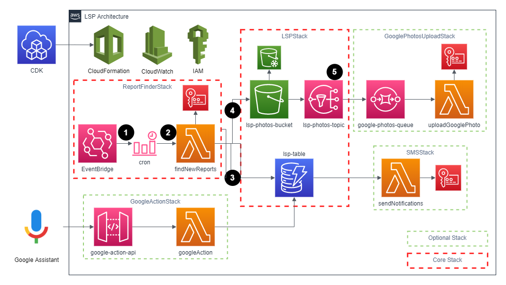

# lsp
Scape LSP for daily reports and photos. This repository is intended to be deployed to AWS as a serverless application.

## Architecture
LSP is broken down into several [stacks](https://docs.aws.amazon.com/AWSCloudFormation/latest/UserGuide/stacks.html) deployed to AWS using the [CDK](https://docs.aws.amazon.com/cdk/latest/guide/home.html).


### Core stacks
These stacks are core to how LSP functions. By installing these core stacks you will have scheduled scraping that stores report metadata in DynamoDB and photos in S3.

- **[LSPStack](packages/cdk/src/lsp-stack.ts)** - defines the main storage mechanisms used for LSP (DynamoDB for report metadata, S3 bucket for photos)
- **[ReportFinderStack](packages/cdk/src/report-finder-stack.ts)** - checks for new reports on a defined schedule

Looking at the architectual diagram above, the core workflow can be described as:
1. EventBridge cron rule triggers `findNewReports` every 15 minutes between 2:00/3:00-5:45/6:45PM (Mountain Times) MON-FRI
2. `findNewReports` lambda function will login to LSP and check for new reports
3. New report metadata is stored in a DynamoDB table called `lsp-table`
4. Photos from reports are stored in an S3 bucket called `lsp-photos-bucket`
    - After 30 days photos are transferred to glacier storage
5. New photos cause a message to be published to the `lsp-photos-topic` topic for more potential downstream processing


### Optional stacks
These stacks are optional and support custom use cases. You can use them as reference to create your own "add-on" stacks that add more functionality to LSP.

- **[GoogleActionStack](packages/cdk/src/google-action-stack.ts)** - Exposes webhooks via API Gateway to respond to Google Action conversation requests that query report metadata
- **[SMSStack](packages/cdk/src/sms-stack.ts)** - Looks at report metadata and potentially triggers an SMS message via the Twilio API
- **[GooglePhotosUploadStack](packages/cdk/src/google-photos-upload-stack.ts)** - Uploads new photos to a Google Photos album

## Installation
Follow these instructions to install and build the dependencies needed for this package.

### Prerequisites
- [Install NodeJS (v14)](https://nodejs.org/en/download/)
- [Install Yarn (optional)](https://classic.yarnpkg.com/lang/en/docs/install)

Run the following commands from the main directory.

```bash
# install main deps
$ yarn

# install package deps and link packages
$ yarn bootstrap

# build packages
$ yarn build
```

## Deploying
Follow these instructions to deploy these stacks to AWS.
### Prerequisites
- [Create an AWS Account](https://aws.amazon.com/resources/create-account/)
- [Create non-root IAM admin user (optional, best practice)](https://docs.aws.amazon.com/IAM/latest/UserGuide/getting-started_create-admin-group.html)
- [Install AWS CLI](https://docs.aws.amazon.com/cli/latest/userguide/install-cliv2.html)
- [Configure AWS CLI Credentials](https://docs.aws.amazon.com/cli/latest/userguide/cli-configure-quickstart.html)

```bash
# Use this to configure your AWS CLI credentials
$ aws configure
```
### Secrets and Environment Variables
Most packages will rely on some secrets and/or environment variables.

```bash
# Core secrets needed
$ aws secretsmanager create-secret --name LS_USERNAME --secret-string CoolDad
$ aws secretsmanager create-secret --name LS_PASSWORD --secret-string SecurePassword!
$ aws secretsmanager create-secret --name LS_DOMAIN --secret-string https://sub.domain.com
```

> You can define environment variables locally in the `packages/cdk/.env` file or via Github actions secrets. Refer to the `packages/<PACKAGE>/README.md` to figure out what secrets or environment varibales are required for each package.

### CDK
The following CDK commands need to be run from the `packages/cdk` directory.

```bash
# cd to cdk package
$ cd packages/cdk

# Deploy core stack
$ [LSP_ERROR_EMAIL=<YOUR EMAIL>] yarn cdk deploy LSPStack

# Deploy optional stacks
$ yarn cdk deploy <GoogleActionStack|GooglePhotosUploadStack|SMSStack>
```

> The `LSP_ERROR_EMAIL` environment variable is optional. If provided, a subscription will be setup with that email for any Lambda errors that occur.

## Google Action (CI/CD)
Github actions can also deploy to AWS using the CDK. You still need to setup your secrets in your AWS region before this will work correctly. 

You can refer to [.github/workflows/deploy-lsp.yml](.github/workflows/deploy-lsp.yml) for exactly what's happening, but the intent is as follows:

1. Every commit to master runs CI that will build, lint, and test each package.
2. If you have `AWS_ACCESS_KEY_ID` secret setup in your Github project
    - `cdk diff` will be ran against your change
3. If you tag a release and have `AWS_ACCESS_KEY_ID` secret setup in your Github project
    - `cdk deploy --all --require-approval never` will be ran against your change
    - It's important to remove any optional stacks from [packages/cdk/src/lsp-stack.ts](packages/cdk/src/lsp-stack.ts) that you do not want to have deployed

> NOTE: Only `AWS_ACCESS_KEY_ID` is checked to run the Github action, but you will also need `AWS_SECRET_ACCESS_KEY`, `AWS_REGION`, and `LSP_ERROR_EMAIL` (optional) for the action to complete successfully.